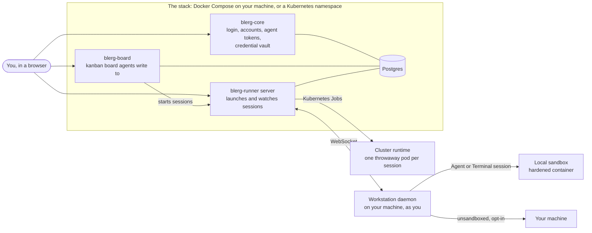

# Architecture

Blerg is three services, a database, and the places where sessions actually run.

## Components

- **`blerg-core`** is the control plane. It issues the login every other component accepts, holds
  each person's engine and git credentials encrypted, mints agent tokens, and serves the `/agents`
  manifest that describes the whole install. Configuration: [`core/docs/CONFIG.md`](../core/docs/CONFIG.md).
- **`blerg-board`** is a kanban board built for agents to write cards and people to curate them.
  An admission step turns away duplicates and vague cards; a card can start a session through the
  runner. [`board/README.md`](../board/README.md), [`board/docs/CONFIG.md`](../board/docs/CONFIG.md).
- **`blerg-runner`** launches and supervises agent sessions and streams their work back as
  structured events. Its web UI has the launch sheet and the chat; its REST contract and MCP server
  are what agents and tools use. [`runner/README.md`](../runner/README.md).
- **The workstation daemon** runs on your machine, as you, and does the actual launching for the
  desktop install. It cannot be containerised because it drives your own `claude` or `codex` login
  and `tmux`. [`install/desktop/DAEMON.md`](../install/desktop/DAEMON.md).
- **Postgres** holds the records: one database per service (`blerg_core`, `blerg_board`,
  `blerg_runner`) in one instance, on both installs. Files a session publishes or you upload sit
  on the runner's data volume, and the credential encryption key is in `.env` or the
  `blerg-secrets` Secret. [`docs/backup-and-restore.md`](backup-and-restore.md) lists all of it.

The three services share one login: core issues it, and the board and runner verify it. The
board and runner never see a password. Agents authenticate with tokens core mints, scoped by a
preset, and a session gets a token of its own, valid for that session only and revoked when it
ends.

## Runtimes

Every session runs in exactly one place, chosen on the launch sheet:

| Runtime | Where | Default on | Sees |
|---|---|---|---|
| **Local sandbox** | A hardened container on the daemon's host: capabilities dropped, memory and processes limited | the desktop install | the repository at `/workspace`, and the engine logins mounted in so the engine can work |
| **Cluster** | A throwaway Kubernetes Job in its own namespace, with the credentials of the person who launched it | the Kubernetes install | the repository, and the credentials core fetched for that person |
| **This machine** | The daemon's host, unsandboxed, as the person running the daemon | never; needs an acknowledgement | everything that person can see |

How cluster sessions are built, scheduled and cleaned up: [`install/k8s/CLUSTER-RUNTIME.md`](../install/k8s/CLUSTER-RUNTIME.md).
How the local sandbox is hardened and what it mounts: [`install/desktop/DAEMON.md`](../install/desktop/DAEMON.md).
Changing the image sessions run in: [`sandbox-image.md`](sandbox-image.md).

## Session kinds

- An **Agent** session drives the engine non-interactively: the engine's permission prompts are
  bypassed and its work streams into the chat as structured events. It is `interactive` when a
  person is reading along and `unattended` when nobody is, and the engine is told which.
- A **Terminal** session is a `tmux` session you watch and type in, with the engine's permission
  prompts on. It is offered by a workstation daemon only (sandbox or host), not by the cluster
  runtime.
- A **cron** is an unattended agent session on a schedule, with only the tools you chose.

What a session can reach, and how messages, files and MCP tools get in and out, is described from
the person's side in [`talking-to-an-agent.md`](talking-to-an-agent.md),
[`artifacts.md`](artifacts.md) and [`mcp-connections.md`](mcp-connections.md), and from the
agent's side in [`AGENTS.md`](../AGENTS.md).

## Repository layout

| Path | What |
|---|---|
| `contracts/` | Go packages shared by the services: identity, secrets, the agents manifest, network guards |
| `core/`, `board/`, `runner/` | One Go module and one web app each |
| `packages/chat/` | `@blerglab/chat`, the chat surface as a package, used by the runner and the board and installable by other apps |
| `install/desktop/`, `install/k8s/` | The two installers, with their own documentation |
| `docs/` | User documentation and, under `design/`, the notes behind larger decisions |
| `scripts/` | Checks CI runs: links, the privacy scrub, the release tooling |
